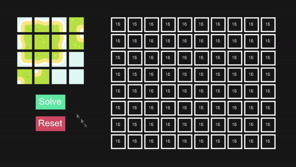

# Wave Function Collapse Implementation

This project is one implementation of the famous Wave Function Collapse Algorithm. I initially wanted to develop this demo because I love Oskar Stålberg's work. He has done some amazing things and I admire him a lot.

The main goal when making this project was to test my abilities with C++, test how powerful my own 2d engine was and learn to implement in C++ the wave function collapse algorithm. It has basically been a huge learning experience for me, even though it might not seem like much.